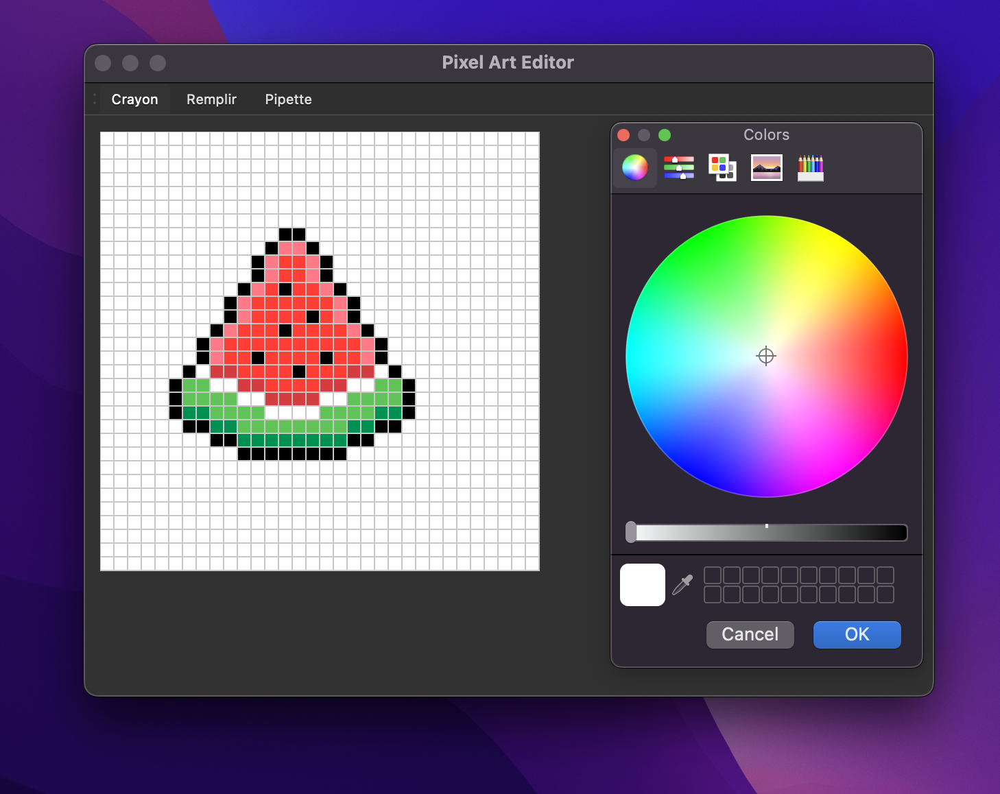

# Pixel Art Editor

Un éditeur de pixel art créé avec PyQt6.



## Installation

1. Cloner le repository
2. Installer les dépendances :
```bash
pip install -r requirements.txt
```

## Utilisation

Pour lancer l'application :
```bash
cd src
python main.py
```

### Raccourcis clavier

- `Ctrl+E` : Exporter en PNG
- `Ctrl+N` : Effacer le canvas

### Contrôles souris

- Clic gauche : Dessiner avec la couleur sélectionnée
- Clic droit : Effacer (pixel blanc)
- Clic milieu + glisser : Déplacer la vue
- Molette : Zoom avant/arrière

## Dépendances

- PyQt6
- Pillow
- NumPy 